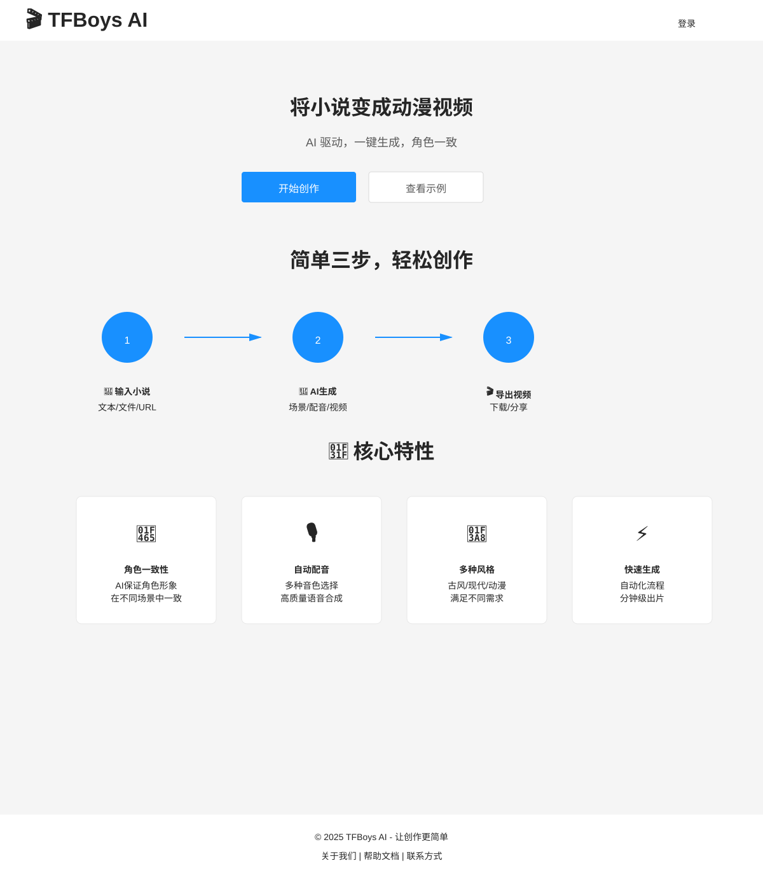
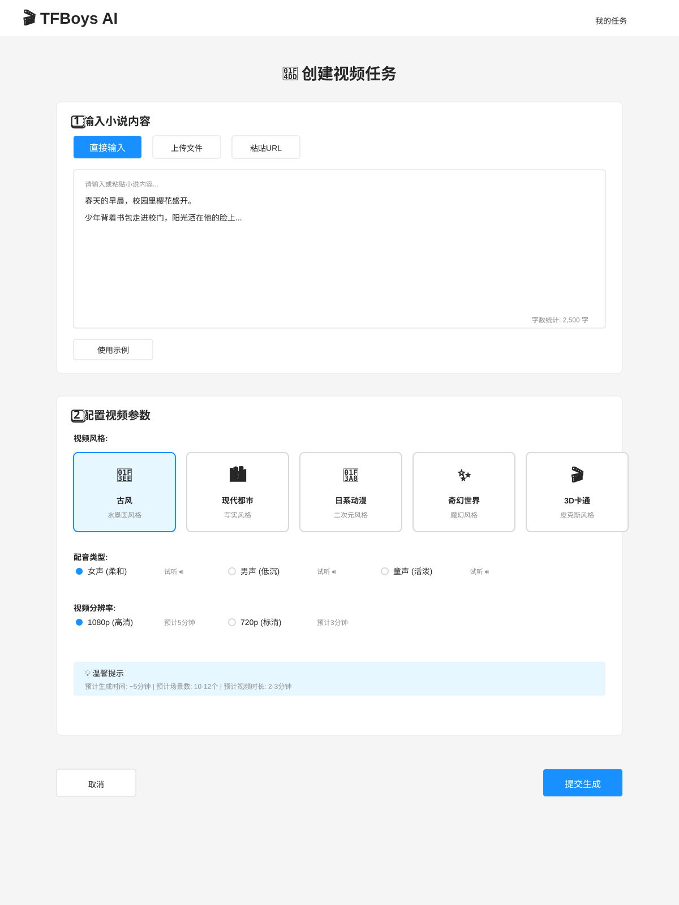
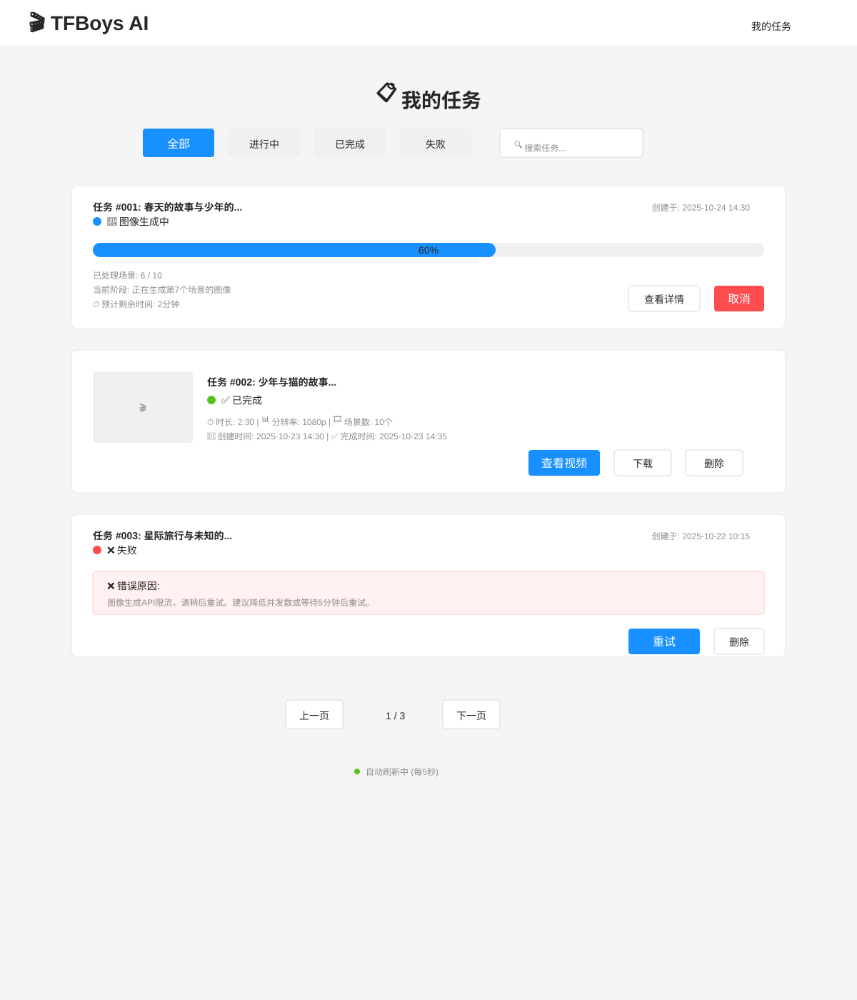
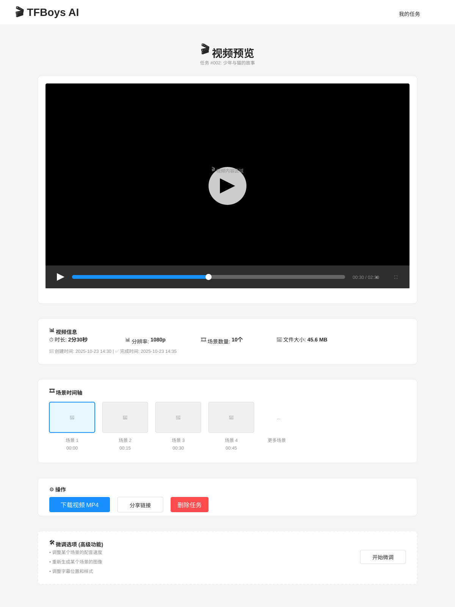
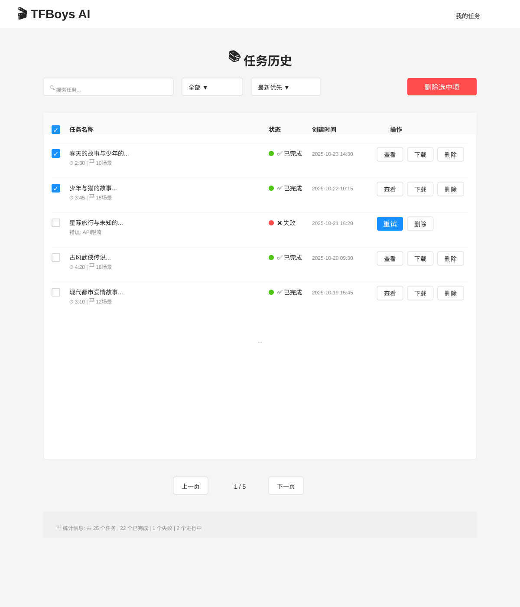

# TFBoys AI - 前端产品设计文档

## 目录

- [1. 产品概述](#1-产品概述)
  - [1.1 产品定位](#11-产品定位)
  - [1.2 核心价值](#12-核心价值)
  - [1.3 目标用户](#13-目标用户)
- [2. 用户流程设计](#2-用户流程设计)
  - [2.1 主流程图](#21-主流程图)
  - [2.2 用户核心流程](#22-用户核心流程)
    - [流程 1: 创建视频任务](#流程-1-创建视频任务)
    - [流程 2: 监控任务进度](#流程-2-监控任务进度)
    - [流程 3: 预览和下载视频](#流程-3-预览和下载视频)
    - [流程 4: 管理历史任务](#流程-4-管理历史任务)
  - [2.3 核心用户流程详细说明](#23-核心用户流程详细说明)
    - [流程 1: 输入小说内容](#流程-1-输入小说内容)
    - [流程 2: 配置视频风格和参数](#流程-2-配置视频风格和参数)
    - [流程 3: 提交生成并监控进度](#流程-3-提交生成并监控进度)
    - [流程 4: 预览和微调生成的视频](#流程-4-预览和微调生成的视频)
    - [流程 5: 下载最终作品](#流程-5-下载最终作品)
    - [流程 6: 查看历史任务和管理](#流程-6-查看历史任务和管理)
- [3. 页面设计](#3-页面设计)
  - [3.1 首页 (Home Page)](#31-首页-home-page)
  - [3.2 创建任务页 (Task Create Page)](#32-创建任务页-task-create-page)
  - [3.3 任务列表页 (Task List Page)](#33-任务列表页-task-list-page)
  - [3.4 视频预览页 (Video Preview Page)](#34-视频预览页-video-preview-page)
  - [3.5 任务历史页 (Task History Page)](#35-任务历史页-task-history-page)
- [4. 页面交互流程](#4-页面交互流程)
  - [4.1 页面跳转关系](#41-页面跳转关系)
  - [4.2 任务状态流转](#42-任务状态流转)
  - [4.3 错误处理流程](#43-错误处理流程)
- [5. 页面原型图](#5-页面原型图)
  - [5.1 首页 (Home Page)](#51-首页-home-page)
  - [5.2 创建任务页 (Task Create Page)](#52-创建任务页-task-create-page)
  - [5.3 任务列表页 (Task List Page)](#53-任务列表页-task-list-page)
  - [5.4 视频预览页 (Video Preview Page)](#54-视频预览页-video-preview-page)
  - [5.5 任务历史页 (Task History Page)](#55-任务历史页-task-history-page)

---

## 1. 产品概述

### 1.1 产品定位
TFBoys AI 是一款通过小说文本自动生成动漫视频的 Web 应用。用户输入小说内容，系统自动分析场景、生成图像、配音，并合成为完整的动漫视频。

### 1.2 核心价值
- **自动化创作**：将文字转化为视觉内容，降低视频制作门槛
- **角色一致性**：AI 保证角色在不同场景中的视觉一致性
- **快速生成**：全自动流程，用户只需等待结果
- **风格可定制**：支持多种视频风格（古风、现代、卡通等）

### 1.3 目标用户
- 小说作者：希望为作品制作宣传视频
- 内容创作者：需要快速生成视频内容
- 二次元爱好者：想将喜欢的小说片段可视化

---

## 2. 用户流程设计

### 2.1 主流程图

```
开始
  ↓
[首页] 了解产品 → 点击"开始创作"
  ↓
[创建任务页] 输入小说内容
  ├─ 输入/粘贴文本
  ├─ 上传文件 (.txt)
  └─ 粘贴 URL (小说网站链接)
  ↓
[创建任务页] 配置视频参数
  ├─ 选择风格 (古风/现代/卡通等)
  ├─ 选择配音类型 (男声/女声)
  └─ 选择分辨率 (720p/1080p)
  ↓
点击"提交生成"
  ↓
[任务列表页] 实时监控进度
  ├─ 显示当前状态
  ├─ 显示进度百分比
  └─ 自动轮询更新
  ↓
生成完成 → 自动跳转
  ↓
[视频预览页] 预览视频
  ├─ 在线播放
  ├─ 下载视频
  └─ 微调选项 (可选)
  ↓
[任务历史] 查看历史任务
  ├─ 查看所有任务
  ├─ 重新下载
  └─ 删除任务
  ↓
结束
```

### 2.2 用户核心流程

#### 流程 1: 创建视频任务
1. 访问首页
2. 点击"开始创作"
3. 选择输入方式(文本/文件/URL)
4. 输入小说内容
5. 配置视频风格和参数
6. 提交生成

#### 流程 2: 监控任务进度
1. 自动跳转任务列表页
2. 查看任务状态和进度
3. 等待任务完成(自动刷新)
4. 收到完成通知

#### 流程 3: 预览和下载视频
1. 点击"查看视频"
2. 在线播放预览
3. 查看场景时间轴
4. 下载视频或生成分享链接

#### 流程 4: 管理历史任务
1. 进入任务历史页
2. 搜索或筛选任务
3. 批量操作(删除)
4. 重新下载或查看任务

### 2.3 核心用户流程详细说明

#### 流程 1: 输入小说内容
**场景**：用户准备好小说文本，开始创建视频任务

**步骤**：
1. 进入首页，点击"开始创作"按钮
2. 进入创建任务页面，看到三种输入方式：
   - **方式 1**：直接在文本框中输入或粘贴小说内容
   - **方式 2**：点击"上传文件"，选择本地 .txt 文件
   - **方式 3**：粘贴小说网站 URL（系统自动抓取内容）
3. 系统实时显示字数统计（如：2,500 字）
4. 如果字数超过限制，显示警告提示

**交互细节**：
- 文本框支持 Markdown 预览（可选）
- 文件上传支持拖拽功能
- URL 粘贴后自动验证并抓取内容
- 提供示例文本，用户可一键导入测试

---

#### 流程 2: 配置视频风格和参数
**场景**：用户已输入小说内容，开始配置视频生成参数

**步骤**：
1. 在创建任务页面，向下滚动至"视频配置"区域
2. 选择视频风格：
   - 古风（水墨画风格）
   - 现代都市（写实风格）
   - 日系动漫（二次元风格）
   - 奇幻世界（科幻/魔幻）
   - 3D 卡通（皮克斯风格）
3. 选择配音类型：
   - 女声（柔和/清澈）
   - 男声（低沉/磁性）
   - 童声（可爱/活泼）
   - 机器人声（科技感）
4. 选择视频分辨率：
   - 720p（快速生成）
   - 1080p（高清画质）

**交互细节**：
- 风格选择提供缩略图预览
- 配音类型可试听样例
- 分辨率选择显示预计生成时间
- 实时显示预估成本（可选）

---

#### 流程 3: 提交生成并监控进度
**场景**：用户配置完成，提交任务并等待生成

**步骤**：
1. 点击页面底部"提交生成"按钮
2. 系统验证输入，显示确认弹窗：
   - 显示任务摘要（字数、风格、预计时间）
   - 用户确认后提交
3. 自动跳转至任务列表页
4. 显示任务卡片，包含：
   - 任务标题（小说前 20 字作为标题）
   - 当前状态（等待中/文本分析中/图像生成中/配音生成中/视频合成中）
   - 进度条（0-100%）
   - 预计剩余时间
5. 页面每 5 秒自动轮询更新状态

**交互细节**：
- 提交时显示 Loading 动画
- 任务卡片状态实时更新
- 支持取消正在处理的任务
- 生成完成时浏览器通知（需用户授权）
- 失败时显示错误原因和重试按钮

---

#### 流程 4: 预览和微调生成的视频
**场景**：任务完成，用户查看生成的视频

**步骤**：
1. 任务完成后，任务列表页显示"查看视频"按钮
2. 点击按钮，跳转至视频预览页
3. 视频预览页展示：
   - 视频播放器（支持全屏、倍速、进度条）
   - 视频信息（时长、分辨率、场景数量）
   - 场景缩略图（时间轴展示）
   - 下载按钮
4. 微调选项（高级功能，可选）：
   - 调整某个场景的配音速度
   - 重新生成某个场景的图像
   - 调整字幕位置和样式

**交互细节**：
- 视频播放器支持键盘快捷键
- 场景缩略图可点击跳转
- 下载按钮显示文件大小
- 微调后重新生成视频

---

#### 流程 5: 下载最终作品
**场景**：用户对视频满意，准备下载

**步骤**：
1. 在视频预览页，点击"下载视频"按钮
2. 浏览器弹出下载对话框
3. 文件名自动生成：`tfboys_任务ID_日期时间.mp4`
4. 下载完成后，显示"下载成功"提示
5. 提供"分享"按钮（生成分享链接）

**交互细节**：
- 支持多种格式下载（MP4/WebM）
- 显示下载进度条
- 下载失败时提供重试
- 分享链接有效期 7 天

---

#### 流程 6: 查看历史任务和管理
**场景**：用户想查看之前生成的视频或管理任务

**步骤**：
1. 点击顶部导航栏"我的任务"
2. 进入任务历史页面，显示所有任务列表
3. 任务卡片展示：
   - 任务标题
   - 创建时间
   - 状态（已完成/失败/进行中）
   - 缩略图
   - 操作按钮（查看/下载/删除）
4. 筛选和排序：
   - 按状态筛选（全部/已完成/失败）
   - 按时间排序（最新/最早）
   - 搜索任务（关键词）
5. 批量操作：
   - 批量删除
   - 批量下载

**交互细节**：
- 列表支持分页（每页 10 条）
- 删除时弹出二次确认
- 失败的任务可直接重试
- 支持导出任务列表（CSV）

---

## 3. 页面设计

### 3.1 首页 (Home Page)

#### 3.1.1 页面布局
```
┌────────────────────────────────────────────┐
│           [Logo] TFBoys AI        [登录]   │  ← Header
├────────────────────────────────────────────┤
│                                            │
│         🎬 将小说变成动漫视频              │
│                                            │
│    [开始创作]  [查看示例]                  │  ← Hero Section
│                                            │
├────────────────────────────────────────────┤
│                                            │
│   📝 输入小说  →  🎨 AI生成  →  🎬 导出   │  ← 流程说明
│                                            │
├────────────────────────────────────────────┤
│                                            │
│            🌟 核心特性                     │
│   ┌─────┐  ┌─────┐  ┌─────┐               │
│   │角色  │  │自动  │  │多种  │              │  ← 特性展示
│   │一致性│  │配音  │  │风格  │              │
│   └─────┘  └─────┘  └─────┘               │
│                                            │
└────────────────────────────────────────────┘
```

#### 3.1.2 页面内容
1. **顶部导航栏 (Header)**
   - Logo + 产品名称
   - 导航菜单：首页、我的任务、帮助文档
   - 登录/注册按钮（右侧）

2. **Hero 区域**
   - 主标题："将小说变成动漫视频"
   - 副标题："AI 驱动，一键生成，角色一致"
   - CTA 按钮："开始创作"（大号，醒目）
   - 辅助按钮："查看示例"

3. **流程说明区域**
   - 三步流程图（输入 → 生成 → 导出）
   - 每步配有图标和简短说明

4. **核心特性区域**
   - 3-4 个特性卡片（图标 + 标题 + 描述）
   - 特性 1：角色一致性保证
   - 特性 2：自动配音生成
   - 特性 3：多种风格选择
   - 特性 4：快速生成

5. **底部 (Footer)**
   - 关于我们、联系方式、技术支持
   - 社交媒体链接

#### 3.1.3 交互设计
- 点击"开始创作"跳转至创建任务页
- 点击"查看示例"弹出示例视频对话框
- 特性卡片支持 Hover 效果

---

### 3.2 创建任务页 (Task Create Page)

#### 3.2.1 页面布局
```
┌────────────────────────────────────────────┐
│           [Logo] TFBoys AI        [我的]   │  ← Header
├────────────────────────────────────────────┤
│                                            │
│   📝 创建视频任务                          │  ← 页面标题
│                                            │
│   ┌──────────────────────────────────┐    │
│   │ 1️⃣ 输入小说内容                 │    │
│   │                                  │    │
│   │ [直接输入] [上传文件] [粘贴URL]  │    │  ← 输入方式Tab
│   │                                  │    │
│   │ ┌──────────────────────────────┐ │    │
│   │ │                              │ │    │
│   │ │   [文本输入框/文件上传区域]  │ │    │  ← 输入区域
│   │ │                              │ │    │
│   │ └──────────────────────────────┘ │    │
│   │                                  │    │
│   │ 字数统计: 2,500 字               │    │
│   └──────────────────────────────────┘    │
│                                            │
│   ┌──────────────────────────────────┐    │
│   │ 2️⃣ 配置视频参数                 │    │
│   │                                  │    │
│   │ 视频风格:                        │    │
│   │ [🏮古风] [🏙️现代] [🎨动漫] [✨奇幻]│    │  ← 风格选择
│   │                                  │    │
│   │ 配音类型:                        │    │
│   │ (•) 女声  ( ) 男声  ( ) 童声    │    │  ← 配音选择
│   │                                  │    │
│   │ 视频分辨率:                      │    │
│   │ (•) 1080p (高清)                │    │  ← 分辨率选择
│   │ ( ) 720p (标清，更快)           │    │
│   │                                  │    │
│   └──────────────────────────────────┘    │
│                                            │
│   预计生成时间: ~5分钟                     │  ← 提示信息
│                                            │
│              [取消]  [提交生成]           │  ← 操作按钮
│                                            │
└────────────────────────────────────────────┘
```

#### 3.2.2 页面内容

**1. 输入小说内容区域**
- Tab 切换：直接输入 | 上传文件 | 粘贴 URL
- **直接输入 Tab**：
  - 多行文本框（支持 Markdown）
  - 字数实时统计
  - 提供"使用示例"按钮
- **上传文件 Tab**：
  - 拖拽上传区域
  - 支持 .txt 文件
  - 显示文件名和大小
- **粘贴 URL Tab**：
  - URL 输入框
  - 支持的网站列表（起点、晋江等）
  - 自动抓取内容预览

**2. 配置视频参数区域**
- **视频风格选择**：
  - 大图标卡片（4-5 个风格）
  - 每个风格有预览图和名称
  - 选中状态高亮显示
- **配音类型选择**：
  - 单选按钮组
  - 每个选项提供试听按钮
- **视频分辨率**：
  - 单选按钮组
  - 显示预计生成时间差异

**3. 底部操作区**
- 预计生成时间提示
- 取消按钮（返回首页）
- 提交按钮（大号，主色调）

#### 3.2.3 交互设计
- 输入内容时实时验证（字数限制）
- 参数选择时更新预估时间
- 提交前弹出确认对话框
- 提交后显示 Loading，跳转至任务列表

#### 3.2.4 表单验证
- 小说内容不能为空
- 字数限制：100 - 10,000 字
- 必须选择视频风格
- URL 格式验证

---

### 3.3 任务列表页 (Task List Page)

#### 3.3.1 页面布局
```
┌────────────────────────────────────────────┐
│           [Logo] TFBoys AI        [我的]   │  ← Header
├────────────────────────────────────────────┤
│                                            │
│   📋 我的任务                              │  ← 页面标题
│                                            │
│   [全部] [进行中] [已完成] [失败]  [🔍搜索]│  ← 筛选Tab
│                                            │
│   ┌──────────────────────────────────┐    │
│   │ 任务 #001: 春天的故事...         │    │
│   │                                  │    │
│   │ 状态: 🔄 图像生成中              │    │
│   │ 进度: ████████░░░░░░░░ 60%      │    │  ← 任务卡片 1
│   │ 预计剩余: 2分钟                  │    │
│   │                                  │    │
│   │          [查看详情] [取消任务]   │    │
│   └──────────────────────────────────┘    │
│                                            │
│   ┌──────────────────────────────────┐    │
│   │ 任务 #002: 少年与猫...           │    │
│   │                                  │    │
│   │ 状态: ✅ 已完成                  │    │
│   │ 时长: 2:30  |  10个场景         │    │  ← 任务卡片 2
│   │ 创建时间: 2025-10-23 14:30      │    │
│   │                                  │    │
│   │   [查看视频] [下载] [删除]       │    │
│   └──────────────────────────────────┘    │
│                                            │
│   ┌──────────────────────────────────┐    │
│   │ 任务 #003: 星际旅行...           │    │
│   │                                  │    │
│   │ 状态: ❌ 失败                    │    │  ← 任务卡片 3
│   │ 错误: 图像生成API限流            │    │
│   │                                  │    │
│   │          [重试] [删除]           │    │
│   └──────────────────────────────────┘    │
│                                            │
│           [上一页]  1/3  [下一页]         │  ← 分页
│                                            │
└────────────────────────────────────────────┘
```

#### 3.3.2 页面内容

**1. 筛选和搜索区域**
- Tab 切换：全部 | 进行中 | 已完成 | 失败
- 搜索框（按任务标题搜索）
- 排序选项：最新优先 | 最早优先

**2. 任务卡片（根据状态不同显示不同内容）**

**进行中的任务卡片**：
- 任务标题（小说前 20 字）
- 当前状态图标 + 文字（文本分析中/图像生成中等）
- 进度条（0-100%）
- 已处理场景数 / 总场景数
- 预计剩余时间
- 操作按钮：查看详情 | 取消任务

**已完成的任务卡片**：
- 任务标题
- 状态：✅ 已完成
- 视频缩略图
- 视频时长、场景数量
- 创建时间
- 操作按钮：查看视频 | 下载 | 删除

**失败的任务卡片**：
- 任务标题
- 状态：❌ 失败
- 错误原因
- 创建时间
- 操作按钮：重试 | 删除

**3. 分页组件**
- 上一页 | 当前页/总页数 | 下一页
- 每页显示 10 条

#### 3.3.3 交互设计
- 页面每 5 秒自动刷新进行中的任务
- 任务完成时浏览器通知
- 删除任务前弹出二次确认
- 支持批量删除（复选框）

#### 3.3.4 实时更新逻辑
```javascript
// 轮询逻辑
setInterval(() => {
  if (hasProcessingTasks) {
    fetchTaskStatus(taskIds)
      .then(updateTaskCards)
  }
}, 5000) // 每5秒轮询一次
```

---

### 3.4 视频预览页 (Video Preview Page)

#### 3.4.1 页面布局
```
┌────────────────────────────────────────────┐
│           [Logo] TFBoys AI        [我的]   │  ← Header
├────────────────────────────────────────────┤
│                                            │
│   🎬 视频预览                              │  ← 页面标题
│   任务 #002: 少年与猫的故事               │
│                                            │
│   ┌──────────────────────────────────┐    │
│   │                                  │    │
│   │                                  │    │
│   │         [视频播放器]             │    │  ← 视频播放器
│   │                                  │    │
│   │         ▶️ 00:30 / 02:30        │    │
│   │                                  │    │
│   └──────────────────────────────────┘    │
│                                            │
│   📊 视频信息                              │
│   时长: 2分30秒 | 分辨率: 1080p            │  ← 视频信息
│   场景数量: 10个 | 文件大小: 45.6 MB      │
│                                            │
│   🎞️ 场景时间轴                            │  ← 场景缩略图
│   [场景1] [场景2] [场景3] [场景4] ...     │
│   00:00   00:15   00:30   00:45           │
│                                            │
│   ⚙️ 操作                                  │
│   [下载视频 MP4] [分享链接] [删除任务]    │  ← 操作按钮
│                                            │
│   🛠️ 微调选项 (高级功能)                   │  ← 可选
│   ┌──────────────────────────────────┐    │
│   │ 调整某个场景的配音速度           │    │
│   │ 重新生成某个场景的图像           │    │
│   └──────────────────────────────────┘    │
│                                            │
└────────────────────────────────────────────┘
```

#### 3.4.2 页面内容

**1. 视频播放器**
- 使用 HTML5 Video 或第三方播放器（Video.js）
- 功能：
  - 播放/暂停
  - 进度条拖拽
  - 音量调节
  - 倍速播放（0.5x, 1x, 1.5x, 2x）
  - 全屏模式
- 键盘快捷键：
  - 空格：播放/暂停
  - ← →：后退/前进 5 秒
  - ↑ ↓：音量增减

**2. 视频信息区域**
- 时长
- 分辨率
- 场景数量
- 文件大小
- 创建时间

**3. 场景时间轴**
- 显示所有场景缩略图
- 每个缩略图下方显示起始时间
- 点击缩略图跳转到对应场景
- 当前播放场景高亮显示

**4. 操作按钮区域**
- **下载视频**：下载 MP4 文件
- **分享链接**：生成 7 天有效期的分享链接
- **删除任务**：删除任务和视频文件

**5. 微调选项（高级功能，可选）**
- 调整场景配音速度
- 重新生成某个场景
- 调整字幕样式
- 调整场景顺序

#### 3.4.3 交互设计
- 页面加载时自动播放视频
- 场景缩略图支持 Hover 预览
- 下载时显示进度条
- 分享链接一键复制
- 删除前二次确认

---

### 3.5 任务历史页 (Task History Page)

#### 3.5.1 页面布局
```
┌────────────────────────────────────────────┐
│           [Logo] TFBoys AI        [我的]   │  ← Header
├────────────────────────────────────────────┤
│                                            │
│   📚 任务历史                              │  ← 页面标题
│                                            │
│   [🔍 搜索任务]  [全部▼] [最新优先▼]      │  ← 搜索和筛选
│                                            │
│   [☑️ 批量操作: 删除选中项]                │  ← 批量操作
│                                            │
│   ┌──────────────────────────────────┐    │
│   │ ☑️ 春天的故事...          ✅     │    │
│   │ 2025-10-23 14:30 | 2:30 | 10场景│    │  ← 任务条目 1
│   │          [查看] [下载] [删除]    │    │
│   └──────────────────────────────────┘    │
│                                            │
│   ┌──────────────────────────────────┐    │
│   │ ☑️ 少年与猫...            ✅     │    │
│   │ 2025-10-22 10:15 | 3:45 | 15场景│    │  ← 任务条目 2
│   │          [查看] [下载] [删除]    │    │
│   └──────────────────────────────────┘    │
│                                            │
│   ┌──────────────────────────────────┐    │
│   │ ☑️ 星际旅行...            ❌     │    │
│   │ 2025-10-21 16:20 | 失败          │    │  ← 任务条目 3
│   │          [重试] [删除]           │    │
│   └──────────────────────────────────┘    │
│                                            │
│           [上一页]  1/5  [下一页]         │  ← 分页
│                                            │
└────────────────────────────────────────────┘
```

#### 3.5.2 页面内容

**1. 搜索和筛选区域**
- 搜索框：按任务标题关键词搜索
- 状态筛选：全部 | 已完成 | 失败
- 排序：最新优先 | 最早优先 | 时长排序

**2. 批量操作区域**
- 全选/取消全选
- 批量删除按钮

**3. 任务列表**
- 每行显示一个任务：
  - 复选框
  - 任务标题
  - 状态图标（✅ 已完成 / ❌ 失败 / 🔄 进行中）
  - 创建时间
  - 视频时长（已完成的任务）
  - 场景数量
  - 操作按钮：查看 | 下载 | 删除（或重试）

**4. 分页组件**
- 每页 20 条
- 上一页 | 当前页/总页数 | 下一页

#### 3.5.3 交互设计
- 搜索实时过滤
- 复选框支持 Shift 多选
- 删除前二次确认
- 支持导出任务列表为 CSV

---

## 4. 页面交互流程

### 4.1 页面跳转关系

```
       [首页]
         ↓
    点击"开始创作"
         ↓
    [创建任务页]
         ↓
      提交任务
         ↓
    [任务列表页] ←──────────────┐
         │                     │
         ├─ 点击"查看视频"     │
         │        ↓            │
         │   [视频预览页]      │
         │        ↓            │
         │    下载/分享        │
         │        ↓            │
         └─ 点击"我的任务" ────┘
                 ↓
         [任务历史页]
```

### 4.2 任务状态流转

```
用户提交任务
    ↓
pending (等待中)
    ↓
analyzing (文本分析中)
    ↓
generating_images (图像生成中)
    ↓
generating_audio (配音生成中)
    ↓
synthesizing_video (视频合成中)
    ↓
completed (已完成) / failed (失败)
```

### 4.3 错误处理流程

```
任务失败
    ↓
显示错误信息
    ↓
用户选择:
    ├─ 重试 → 重新提交任务
    └─ 删除 → 删除任务记录
```

---

## 5. 页面原型图

所有原型图采用 SVG 格式,可在浏览器中直接查看,也可在设计工具中编辑。

### 5.1 首页 (Home Page)



**文件**: [`mockups/01-home-page.svg`](./mockups/01-home-page.svg)

**页面内容**:
- 🎯 Hero 区域:主标题和 CTA 按钮
- 📊 流程说明:3步创作流程展示
- ⭐ 核心特性:4个特性卡片展示
- 📱 响应式布局

**关键元素**:
- "开始创作" 主按钮(跳转创建任务页)
- "查看示例" 次要按钮
- 特性卡片:角色一致性、自动配音、多种风格、快速生成

---

### 5.2 创建任务页 (Task Create Page)



**文件**: [`mockups/02-task-create-page.svg`](./mockups/02-task-create-page.svg)

**页面内容**:
- 📝 输入小说内容区域
  - Tab切换:直接输入 | 上传文件 | 粘贴URL
  - 实时字数统计
  - 示例文本按钮
- 🎨 配置视频参数区域
  - 5种视频风格选择(古风、现代、动漫、奇幻、3D卡通)
  - 配音类型选择(女声、男声、童声)
  - 分辨率选择(1080p、720p)
- ⏱️ 预计生成时间提示

**交互流程**:
1. 用户选择输入方式
2. 输入/上传/粘贴小说内容
3. 配置视频风格和参数
4. 点击"提交生成"按钮
5. 系统验证并跳转任务列表页

---

### 5.3 任务列表页 (Task List Page)



**文件**: [`mockups/03-task-list-page.svg`](./mockups/03-task-list-page.svg)

**页面内容**:
- 🔍 筛选和搜索栏
  - Tab筛选:全部 | 进行中 | 已完成 | 失败
  - 搜索框
- 📋 任务卡片展示
  - **进行中任务**:显示进度条、当前阶段、预计剩余时间
  - **已完成任务**:显示缩略图、视频信息、操作按钮
  - **失败任务**:显示错误信息、重试按钮
- 🔄 自动刷新提示(每5秒)

**任务状态**:
- 🔄 进行中:等待中 → 文本分析 → 图像生成 → 配音生成 → 视频合成
- ✅ 已完成:显示视频信息和下载按钮
- ❌ 失败:显示错误原因和重试按钮

**实时更新**:
- 页面每5秒自动轮询更新任务状态
- 进度条实时更新
- 任务完成时浏览器通知

---

### 5.4 视频预览页 (Video Preview Page)



**文件**: [`mockups/04-video-preview-page.svg`](./mockups/04-video-preview-page.svg)

**页面内容**:
- 🎬 视频播放器
  - HTML5视频播放器(或Video.js)
  - 支持播放/暂停、进度条、音量、倍速、全屏
  - 键盘快捷键支持
- 📊 视频信息栏
  - 时长、分辨率、场景数量、文件大小
  - 创建和完成时间
- 🎞️ 场景时间轴
  - 场景缩略图展示
  - 点击跳转到对应场景
  - 当前播放场景高亮
- ⚙️ 操作按钮
  - 下载视频(MP4格式)
  - 分享链接(7天有效)
  - 删除任务
- 🛠️ 微调选项(高级功能)
  - 调整配音速度
  - 重新生成场景
  - 调整字幕样式

**交互细节**:
- 点击场景缩略图跳转到对应时间点
- 下载时显示进度
- 分享链接一键复制

---

### 5.5 任务历史页 (Task History Page)



**文件**: [`mockups/05-task-history-page.svg`](./mockups/05-task-history-page.svg)

**页面内容**:
- 🔍 搜索和筛选区域
  - 关键词搜索框
  - 状态筛选下拉框(全部/已完成/失败)
  - 排序下拉框(最新优先/最早优先)
- ☑️ 批量操作
  - 全选复选框
  - 批量删除按钮
- 📋 任务列表表格
  - 任务名称、状态、创建时间
  - 视频时长和场景数(已完成任务)
  - 操作按钮:查看/下载/删除(或重试)
- 📄 分页组件
  - 每页显示20条
  - 上一页/下一页按钮
- 📊 统计信息栏
  - 总任务数、完成数、失败数、进行中数

**功能特性**:
- 支持按状态筛选
- 支持关键词搜索
- 支持批量删除
- 失败任务可直接重试
